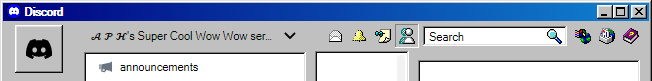
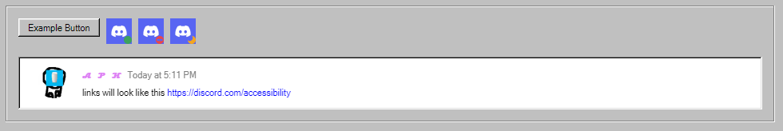
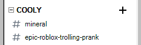

# discord-winclassic
A theme i made for Discord using stuff from 98.css
This theme works better with light mode enabled however dark mode support is being worked on

You can change the colors of elements by changing some of the variables at the top

98.css: https://jdan.github.io/98.css/

